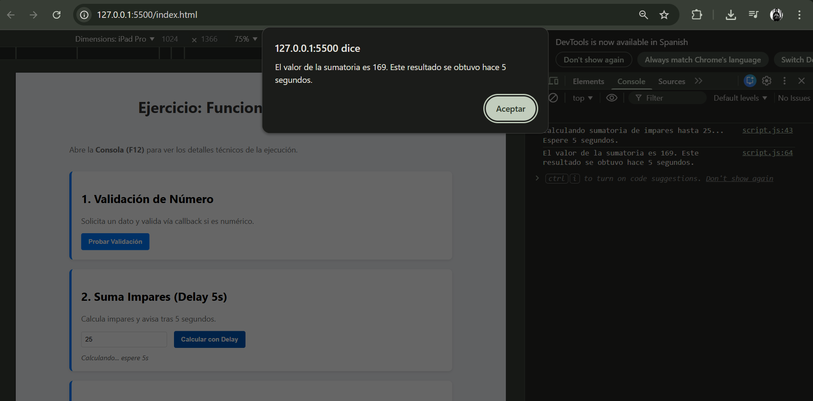
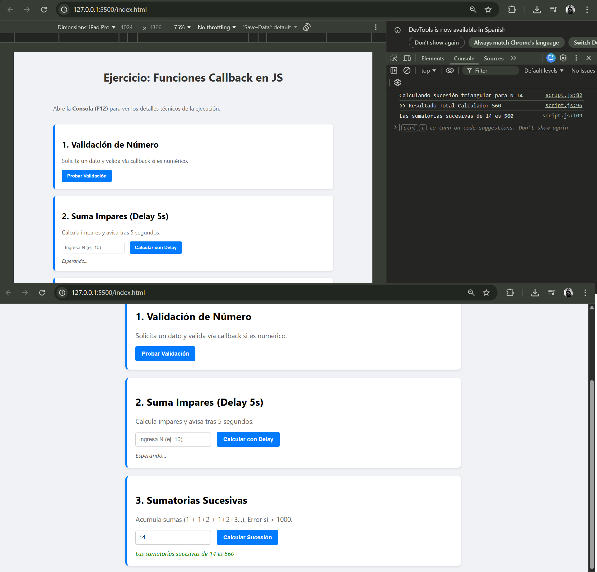

# Funciones Callback en JavaScript


## Descripción
Este proyecto pone en práctica el concepto de **Callbacks** y **Asincronía (setTimeout)** en JavaScript. Se resuelven tres problemas lógicos donde las funciones reciben otras funciones como parámetros para manejar el éxito, el error o el retardo en la ejecución.

## Funcionalidades Implementadas

### 1. Validación de Datos (`validar_numero`)
- **Lógica:** Solicita un dato vía `prompt` y utiliza un callback para confirmar si es numérico o reportar un error.
- **Validación:** Uso de `isNaN()` y control de strings vacíos.

### 2. Asincronía y Retardo (`calcular_y_avisar_despues`)
- **Lógica:** Calcula la sumatoria de números impares hasta `N`.
- **Async:** Utiliza `setTimeout` para simular un proceso lento de **5 segundos**.
- **Callback:** Notifica el resultado pasado el tiempo establecido.

### 3. Flujo Condicional (`calcular_y_avisar_dependiendo`)
- **Lógica:** Realiza una sumatoria de sucesiones (Números triangulares acumulados).
  - Ejemplo ($N=5$): $1 + 3 + 6 + 10 + 15 = 35$.
- **Callbacks Múltiples:** - Ejecuta `callback` si el resultado es < 1000.
  - Ejecuta `callback_error` si el resultado es >= 1000.

## Estructura del Proyecto
```text
├── index.html        # Interfaz de usuario para pruebas
├── css/
│   └── styles.css    # Estilizado de las tarjetas
├── js/
│   └── script.js     # Lógica JS (Callbacks y Algoritmos)
├── img/              # Capturas de pantalla de funcionalidades implementadas
│   └── M4_EP5_Evidencia01.png
│   └── M4_EP5_Evidencia02.png
│   └── M4_EP5_Evidencia03.png
└── README.md         # Documentación
```

## Evidencias

### 1. Validación de Número


### 2. Cálculo Asíncrono (Delay 5s)


### 3. Sumatorias Sucesivas y Flujo de Error


## Instalación y Uso

**Clonar el repositorio:**

git clone [https://github.com/Lfiedlerf/M4_EP4.git](https://github.com/Lfiedlerf/M4_EP4.git)

## Autor
**Luis Fiedler** - Desarrollador en formación

[Perfil de GitHub](https://github.com/Lfiedlerf/)